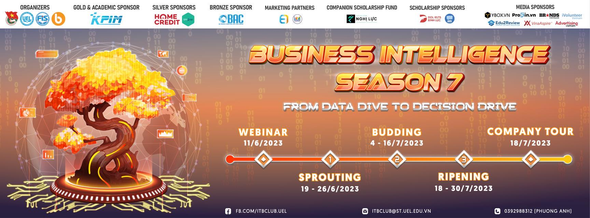

# [Business Intelligence 7](https://github.com/trannhatnguyen2/BusinessIntelligence7)

<b>Cuộc thi Trí Tuệ Kinh Doanh do Câu lạc bộ ITB (Information Technology for Business)</b> trực thuộc khoa Hệ Thống Thông Tin, Trường Đại học Kinh Tế - Luật, ĐHQG TP. HCM tổ chức. Cuộc thi là sân chơi học thuật dành cho các bạn sinh viên quan tâm đến các hướng ngành trong lĩnh vực thông tin kinh doanh và giải pháp Business Intelligence.

## Thành viên nhóm

**`K20-NTS`**

| Họ tên              | Vai trò     |
| ------------------- | ----------- |
| Trần Nhật Nguyên    | Nhóm trưởng |
| Man Đắc Sang        | Thành viên  |
| Trần Thị Kiều Trinh | Thành viên  |

## 🛠️ Business Intelligence là gì?

Trong thời đại kỷ nguyên số hóa và công nghệ lên ngôi, mỗi hoạt động, hành vi của con người đều được ghi nhận dưới dạng dữ liệu. Điều này đòi hỏi chúng ta phải nâng cao khả năng thu thập, lưu trữ, quản lý và xử lý dữ liệu của mình.

<b>Business Intelligence</b> (Trí Tuệ Kinh Doanh) chính là một giải pháp công nghệ mới giúp các nhà quản trị hiểu biết sâu hơn về hoạt động của doanh nghiệp, để đưa ra dự đoán trong tương lai, từ đó đưa ra quyết định trong kinh doanh.

## [Vòng 1 - SPROUTING](https://github.com/trannhatnguyen2/BusinessIntelligence7/tree/main/Round_1)

<b>Tình huống:</b> Bạn được mời về đảm nhận vị trí chuyên viên phân tích dữ liệu cho Meki Group - một chuỗi kinh doanh cà phê có trụ sở tại Mỹ và nhiều chi nhánh trên thế giới. Bạn sẽ được công ty cung cấp các bộ dữ liệu thô dưới dạng .csv về lịch sử bán hàng và các thông tin khác như cửa hàng, thông tin khách hàng, nhân viên và sản phẩm công ty đang kinh doanh. Nhiệm vụ của bạn là hãy sử dụng các kỹ năng và tư duy phân tích, giúp Meki Group trả lời được các câu hỏi xoay quanh các hoạt động kinh doanh của công ty cũng như đưa ra các đề xuất hợp lý để Meki Group có những quyết định kịp thời và chính xác.

## [Vòng 2 - BUDDING](https://github.com/trannhatnguyen2/BusinessIntelligence7/tree/main/Round_2)

<b>KPIM MART</b> là chuỗi siêu thị bán lẻ cung cấp các mặt hàng tiêu dùng như thực phẩm, đồ uống, gia vị và các đồ gia dụng phục vụ cả những khách hàng mua hàng tại cửa hàng và đặt hàng online trên website vận chuyển đến nhà theo hình thức Ecommerce. KPIM Mart có các siêu thị rải rác tại 10 quận Hà Nội nhằm tối ưu tốc độ vận chuyển hàng tới khách hàng.

Ngoài ra, KPIM MART còn tích hợp hệ thống bán hàng online trên ứng dụng App riêng của công ty giúp khách hàng có thể đăng nhập tích điểm khi mua hàng để nâng cấp hạng thẻ thành viên với nhiều quyền lợi khác nhau. Đồng thời, công ty khảo sát nhiều thông tin về khách hàng để hiểu hơn về họ giúp phát động những chương trình quảng bá sản phẩm và giảm giá hợp lý.

Bạn là chuyên viên phân tích dữ liệu thuộc bộ phận công nghệ thông tin của công ty. Bạn được yêu cầu sử dụng công cụ PowerBI và xây dựng các báo cáo theo từng chủ đề phục vụ cho các đối tượng khác nhau tại nhiều đơn vị bao gồm:

    a. Ban Lãnh Đạo
    b. Phòng Bán Hàng
    c. Phòng Chăm Sóc Khách Hàng
    d. Bộ Phận Logistic
    e. Quản Lý tại các Siêu Thị KPIM MART

## 🚀 Kết quả

Top <b>12</b> cuộc thi Business Intelligence 7

---

&copy; 2023 K20-NTS

