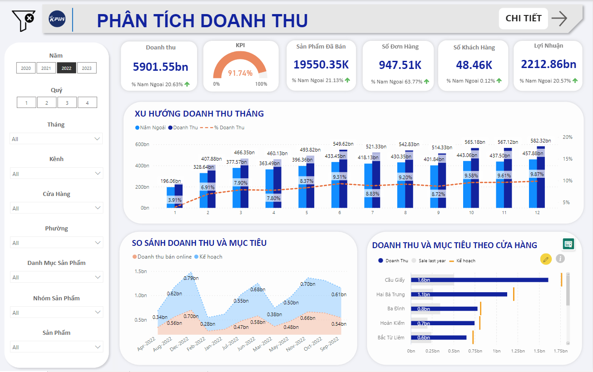
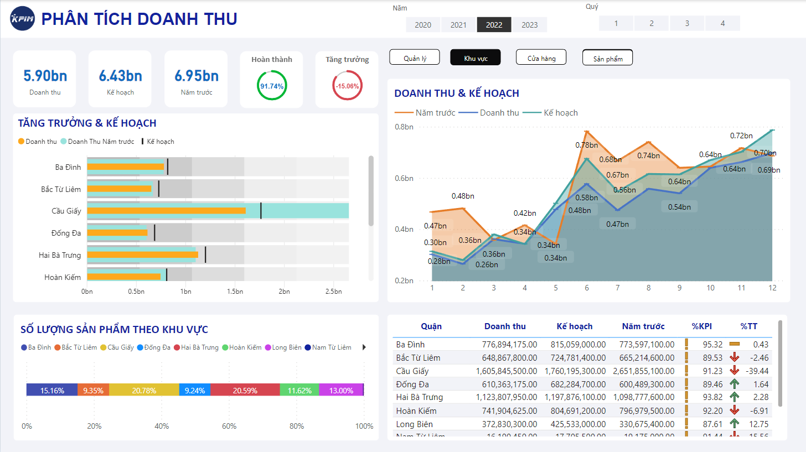
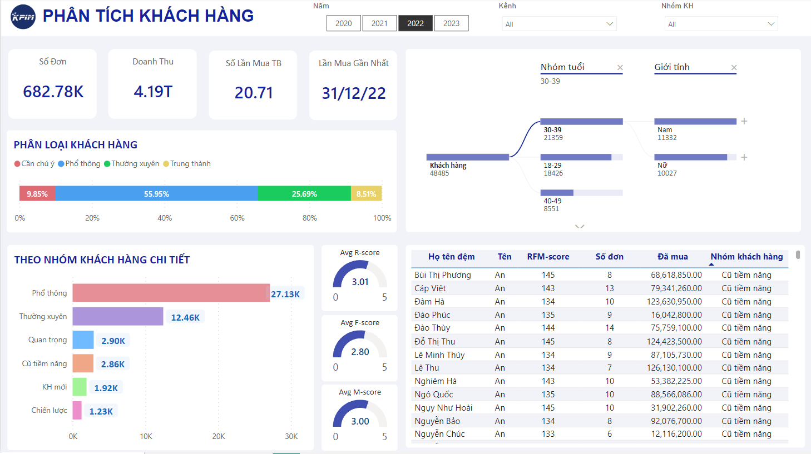
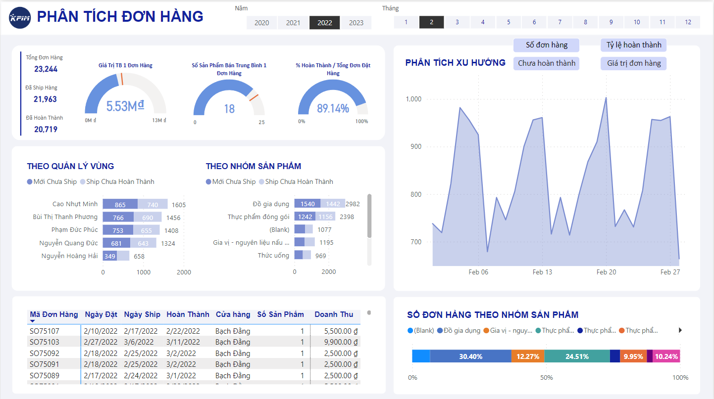
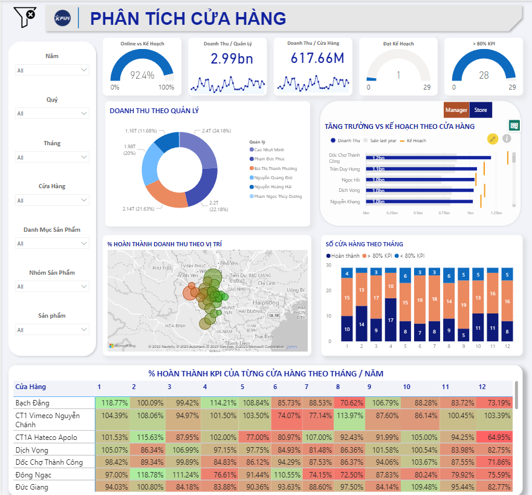

# [Vòng 2 - BUDDING](https://github.com/trannhatnguyen2/BusinessIntelligence7/tree/main/Round_2)

# 📕 Dashboards

<!--ts-->

- 💵 [Phân Tích Doanh Thu](#️-phân-tích-doanh-thu)
- 💲 [Phân Tích Bán Hàng](#-data-source)
- 👦 [Phân Tích Khách Hàng](#-solution)
- 📦 [Phân Tích Đơn Hàng](#-building-data-lake)
- 🏬 [Phân Tích Cửa Hàng](#-building-data-warehouse)
- 🍜 [Phân Tích Sản Phẩm](#️-phân-tích-sản-phẩm)
<!--te-->

  

# 💵 Phân Tích Doanh Thu

    Dashboard Phân Tích Doanh Thu

- Doanh thu và lợi nhuận năm 2021 và 2022 đều tăng lần lượt <b>~50%</b> và <b>~20%</b> so với cùng kỳ năm trước;

- Các chỉ số như số sản phẩm bán, số đơn hàng đều <b>tăng</b> ổn định;

- 4 tháng đầu năm 2023 tất cả chỉ số đều <b>giảm</b>.

==> <b>Tình hình kinh doanh đang đi xuống</b>

# 💲 Phân Tích Bán Hàng

    Dashboard Phân Tích Bán Hàng

- Tháng 6 có doanh thu đột biến qua các năm;

- Hai Bà Trưng và Cầu Giấy có số lượng sản phẩm bán ra chiếm tỉ lệ <b>cao</b>;

==> <b>Có sự chênh lệch doanh thu giữa các cửa hàng và khu vực</b>

# 📦 Phân Tích Khách Hàng

    Dashboard Phân Tích Khách Hàng

- Nhóm khách hàng chiến lược chiếm <b>2.53%</b>, đóng góp <b>48.5%</b> doanh thu vào năm 2022;

- Hầu hết khách hàng thuộc nhóm tuổi từ <b>18-39 tuổi</b>, <b>cân bằng</b> giữa nam và nữ;

- Khách hàng đa phần là <b>Chuyên viên tư vấn, Kỹ thuật viên và Quản lý</b>.

==> <b>Nhóm khách hàng trung thành chiếm hơn 50% doanh thu </b>

# 👦 Phân Tích Đơn Hàng

    Dashboard Phân Tích Đơn Hàng

- Tổng đơn hàng tháng <b>2</b> năm 2022 đạt hơn <b>23k</b> đơn;

- Giá trị TB mỗi đơn hàng hơn <b>5.5Mđ</b> với <b>18-19</b> sản phẩm mỗi đơn;

- Tỷ lệ hoàn thành so với tổng số đơn đạt <b>gần 90%</b>;

- Số đơn hàng <b>tăng dần vào cuối tuần</b> và <b>giảm dần vào các ngày trong tuần</b>.

==> <b>Số đơn hàng càng LỚN --> tỉ lệ hoàn thành càng GIẢM </b>

# 🏬 Phân Tích Cửa Hàng

    Dashboard Phân Tích Cửa Hàng

- Chỉ <b>10%</b> cửa hàng đạt kế hoạch;

- Những tháng đầu năm có tỉ lệ hoàn thành <b>tốt hơn</b>;

- Một quản lý đang nắm nhiều cửa hàng cùng lúc (<b>~ 5 cửa hàng</b>);

- Khu vực <b>phía đông</b> có mức độ hoàn thành kế hoạch <b>cao hơn</b>;

==> <b>Kế hoạch đề ra chưa phù hợp so với thực tế</b>

# 🍜 Phân Tích Sản Phẩm

    Dashboard Phân Tích Sản Phẩm

- <b>10</b> sản phẩm ở lớp <b>A</b> chiếm gần <b>70%</b> về doanh thu;

- Biên lợi nhuận trên doanh thu ổn định tại <b>37%</b>;

- Sản phẩm <b>Máy ép trái cây</b> có doanh thu rất cao.

==> <b>Có 8 sản phẩm class A thuộc nhóm Đồ gia dụng đem lại doanh thu vượt trội</b>

---

&copy; 2023 K20-NTS

